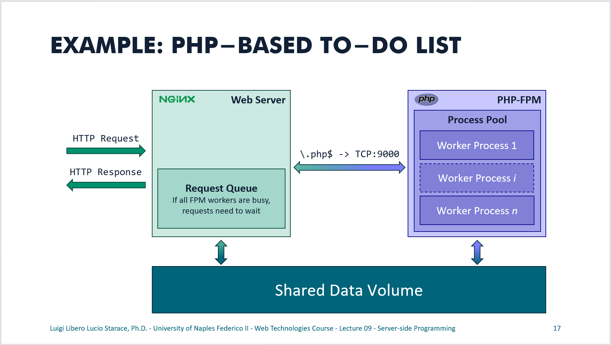

# To-do List with PHP 8

This example includes a simple implementation of To-do List Web Application using NGINX, PHP 8 and PHP-FPM.
The example is fully containerized.

## Running this example

Running this example the easy way requires Docker to be installed on your computer.
If you have Docker installed you can simply clone this repository, then run `docker compose up` in the root directory (the one containing the `docker-compose.yml` file). The application will be available at http://localhost:8080.

If you do not wish to use Docker, you will need to manually install and configure NGINX and PHP-FPM. A nice tutorial is [available on DigitalOcean](https://www.digitalocean.com/community/tutorials/php-fpm-nginx). 
A more beginner-friendly alternative might be to install a PHP development environment such as [XAMPP](https://www.apachefriends.org/), which is available for Windows, Linux and OS X, or [WAMP](https://www.wampserver.com/en/), which is only available for Windows.

If you are a student from the Web Technologies course at the Università degli Studi di Napoli Federico II, note that this will be the first and last time we use PHP! You are not **not** required to install a PHP execution environment, and I suggest you run this example using Docker!

## Overview of the web app

An overview of the architecture of the proposed web app is shown in the figure below.

